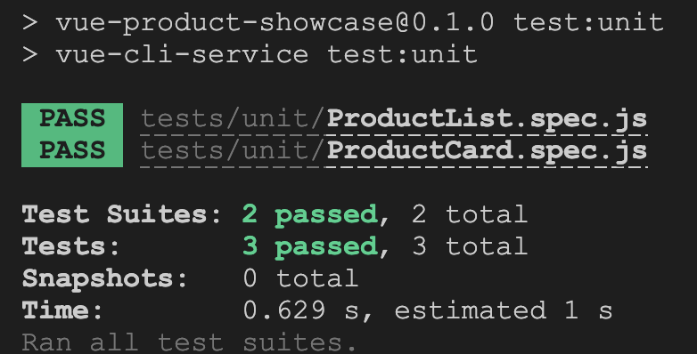
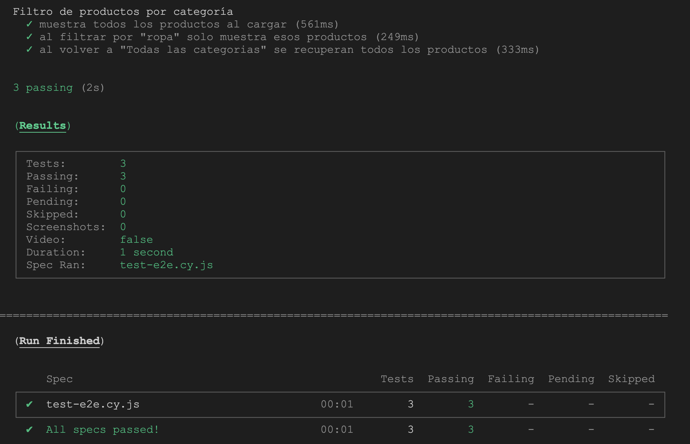
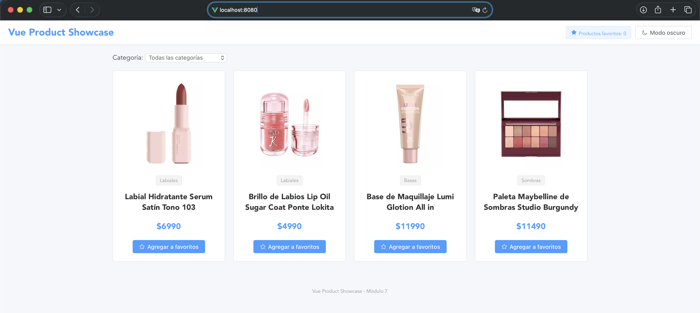
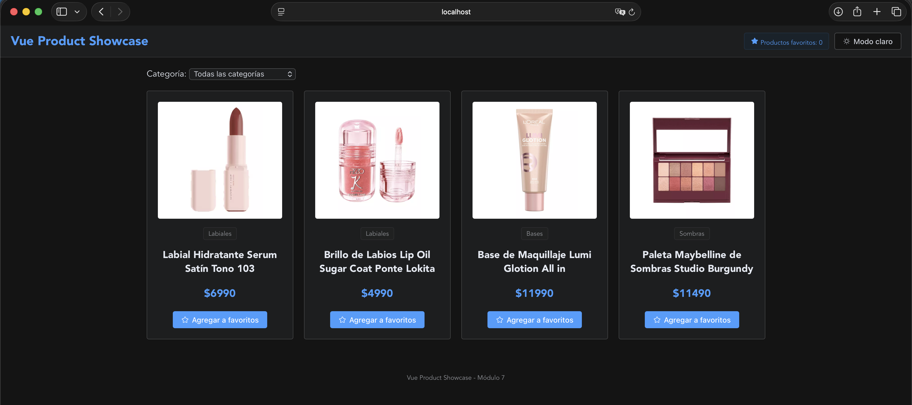
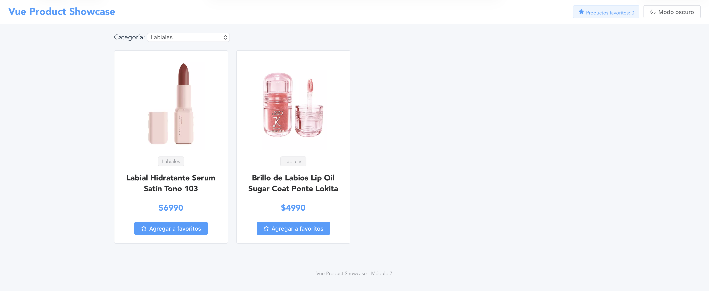
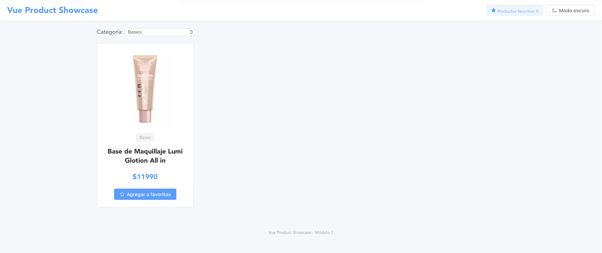
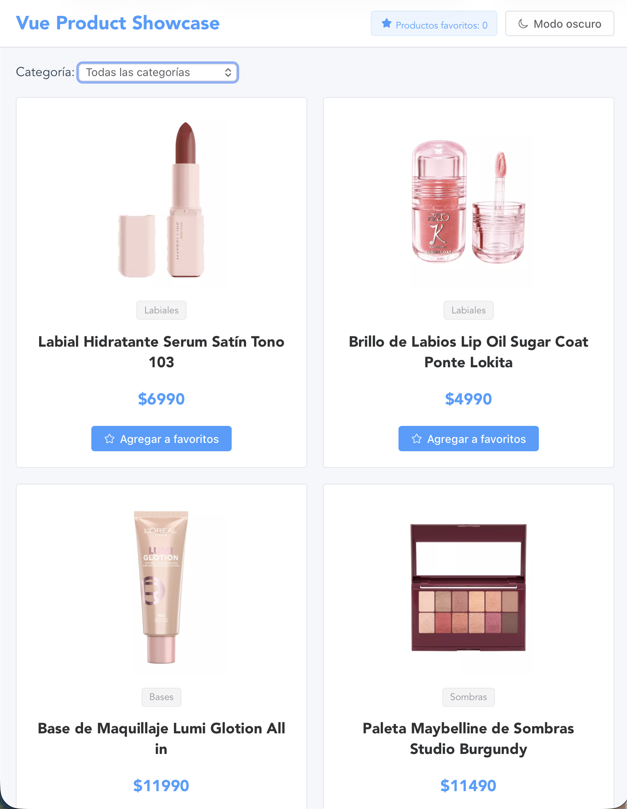
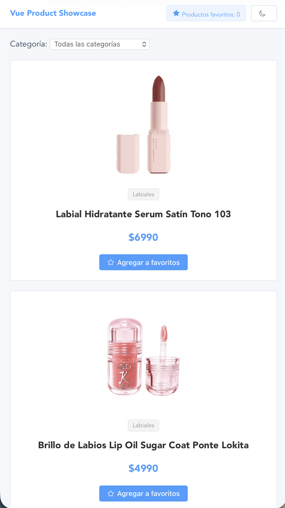
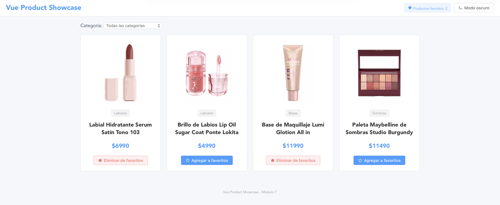

# vue-product-showcase

## Instrucciones de instalación

### Requisitos

Se debe tener instalado node, de la versión 20 en adelante.

### Instalación

Ejecutar:
```
npm install
```
para instalar todas las dependencias

### Ejecución

Una vez instaladas las dependencias se puede ejecutar:
```
npm run iniciar
```
para iniciar el proyecto con la API mock

## Justificaciones técnicas
- Los componentes solicitados con nombre Header y Footer, se cambiaron a PageHader y PageFooter, porque Vue pide que los componentes tengan nombre compuestos por 2 palabras.
- Se decidió utilizar una API mock con json-server porque permite agregar y mostrar productos de mi interes.
- Se decidió agregar un contador de favoritos en el Header del proyecto.

## Pruebas

### Unitarias

Para ejecutar las pruebas unitarias:
```
npm run test:unit
```
Evidencia:


### End to end

Para ejecutar las pruebas end to end:
```
npm run test:e2e
```
Evidencia:


## Demo y evidencias

### Vista principal


### Modo oscuro


### Filtro por categoria


### Modo responsive



### Contador de favoritos

